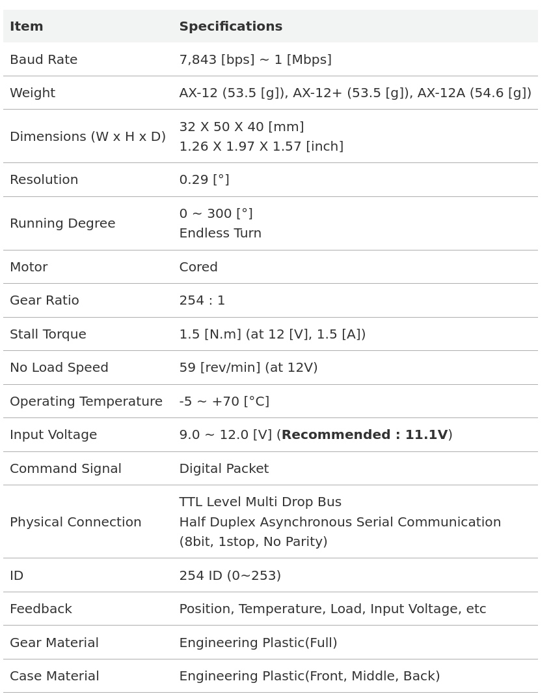
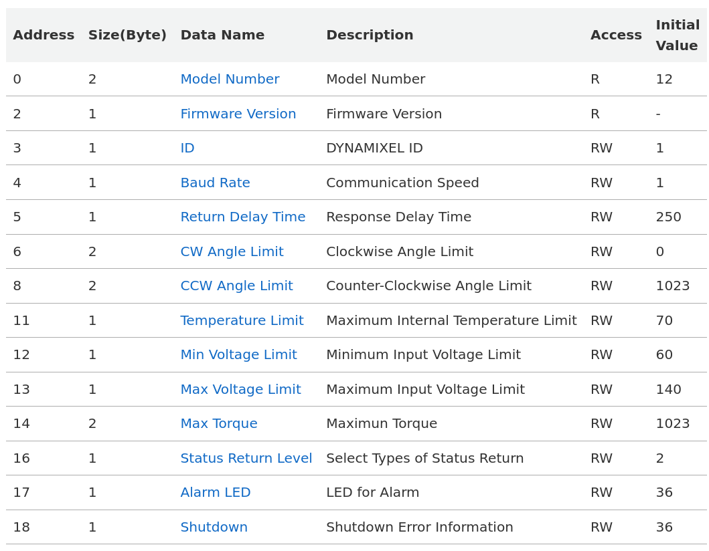
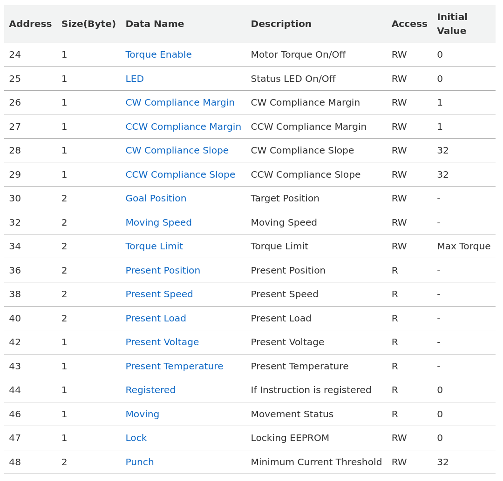

Matériel électronique
=====================

.. contents:: Table des matières
   :depth: 3
   :local:

Descriptions des éléments
-------------------------
Nous nous sommes concentré sur les deux éléments centraux de la maquette : 

- les servomoteurs AX-12A (Dynamixel)
- et le convertisseur d’interface U2D2

Servomoteur AX-12A (Dynamixel)
^^^^^^^^^^^^^^^^^^^^^^^^^^^^^^

Un **Dynamixel** est un type de servo-moteur intelligent développé par la société **ROBOTIS**,
largement utilisé en robotique (recherche, robots humanoïdes, bras robotiques, etc.).

1. Fonction principale
""""""""""""""""""""""

Le Dynamixel sert à générer un mouvement précis et contrôlé. Il peut être utilisé pour :

- Articuler un bras robotique
- Contrôler les jambes ou articulations d’un robot humanoïde
- Piloter des mécanismes orientables (caméra, capteur, plateforme)

2. Particularité « intelligente »
""""""""""""""""""""""""""""""""""

Contrairement à un servo standard, un Dynamixel contient :

- Un microcontrôleur interne
- Un capteur de position (encodeur)
- Des capteurs de courant, tension et température
- Une interface de communication numérique (TTL, RS-485 ou CAN)

Ces éléments permettent au moteur :

- De recevoir des ordres numériques (ex. : aller à 90°)
- De renvoyer des informations (position, effort, température)
- D’être chaîné avec d’autres Dynamixels sur une seule ligne de communication

3. Modes de fonctionnement
""""""""""""""""""""""""""

Selon le modèle, un Dynamixel peut fonctionner en :

- **Position Control Mode**
- **Velocity Control Mode**
- **Current (Torque) Control Mode**
- **PWM Mode**
- **Extended Position Mode**

4. Avantages
""""""""""""

- Haute précision avec retour d’état
- Communication série simplifiée (bus)
- Compatible avec ROS, MATLAB, Arduino, Raspberry Pi
- Grande fiabilité mécanique

5. Exemple d’utilisation
""""""""""""""""""""""""

Un Dynamixel MX-28 peut être utilisé dans un bras robotique à 6 axes.
Chaque axe reçoit une consigne via un contrôleur (ROS, MATLAB) et renvoie sa position réelle
pour la boucle de rétroaction.

6. Documentation technique
""""""""""""""""""""""""""

Les sources des images sont disponibles `à cette adresse <https://emanual.robotis.com/docs/en/dxl/ax/ax-12a/>`_.
A présent, interressons nous au convertisseur d'interface U2D2.

Convertisseur d’interface U2D2
^^^^^^^^^^^^^^^^^^^^^^^^^^^^^^

1. Fonction principale
""""""""""""""""""""""

Le **U2D2 (USB to Dynamixel 2)** est un convertisseur d’interface permettant de relier
un ordinateur ou une carte contrôleur à un ou plusieurs moteurs Dynamixel.

::

   PC / Raspberry Pi / Arduino ⇄ U2D2 ⇄ Dynamixel(s)

Il convertit les signaux USB en signaux série TTL ou RS-485.

2. Rôle technique
"""""""""""""""""

- Conversion de protocole :
  - USB → TTL (AX, XL, XM-T)
  - USB → RS-485 (XM-R, XH, PRO)
- Le U2D2 ne fournit **pas** l’alimentation moteur
- L’alimentation est externe (Power Hub recommandé)

3. Schéma typique de connexion
""""""""""""""""""""""""""""""

::

   [PC / MATLAB / ROS]
            |
           USB
            |
          [U2D2]
            |
   [Dynamixel #1] ↔ [Dynamixel #2] ↔ ... ↔ [Dynamixel #n]

4. Avantages
""""""""""""

- Plug & play
- Compatible avec tous les logiciels ROBOTIS
- Fonctionne avec ROS, MATLAB, Python, C++
- Diagnostic et mise à jour firmware possibles

