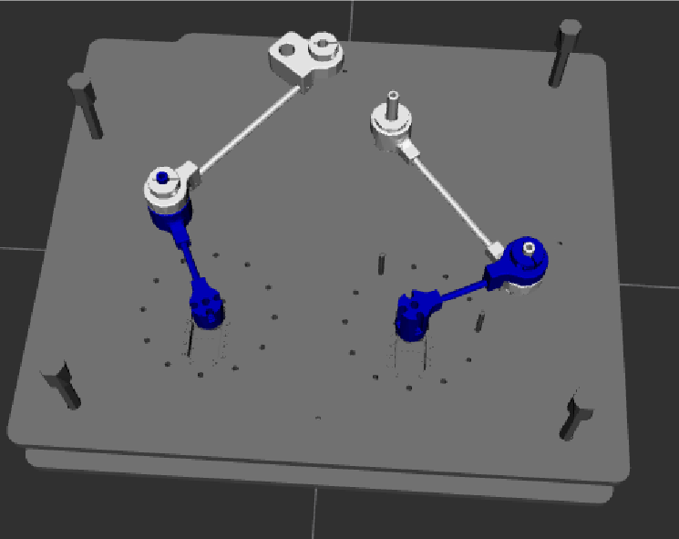
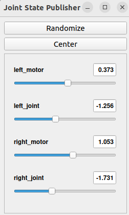

Visualisation RViz
==================

On a créé un programme, qui permet de visualiser notre fichier URDF, dans RViz. Cependant, nous ne sommes pas parvenus à relier les bras 2 et 3 entre eux. 

De plus on utilise l’outil joint_state_publisher_gui afin de pouvoir commander nos 4 liaisons à la souris.

Voici le programme launch : 

.. code-block:: bash
    
    import os 

    from ament_index_python.packages import get_package_share_directory 

    from launch import LaunchDescription 

    from launch_ros.actions import Node 

    from launch.substitutions import Command 

    

    def generate_launch_description(): 

        # Chemin vers le fichier URDF 

        pkg_name = 'mon_robot_description' 

        file_name = 'robot.xacro' 

        pkg_share = get_package_share_directory(pkg_name) 

        urdf_file = os.path.join(pkg_share, 'urdf', file_name) 

    

        #utilise pour comprendre le fichier xacro 

        robot_desc = Command(['xacro ', urdf_file]) 

    

        return LaunchDescription([ 

            # Noeud qui publie l'état du robot 

            Node( 

                package='robot_state_publisher', 

                executable='robot_state_publisher', 

                name='robot_state_publisher', 

                output='screen', 

                parameters=[{'robot_description': robot_desc}], 

            ), 

            

            # Fenêtre pour bouger les joints manuellement 

            Node( 

                package='joint_state_publisher_gui', 

                executable='joint_state_publisher_gui', 

                name='joint_state_publisher_gui', 

                output='screen', 

            ), 

            

            # Noeud Rviz2 pour la visualisation 

            Node( 

                package='rviz2', 

                executable='rviz2', 

                name='rviz2', 

                output='screen', 

            ), 

        ]) 