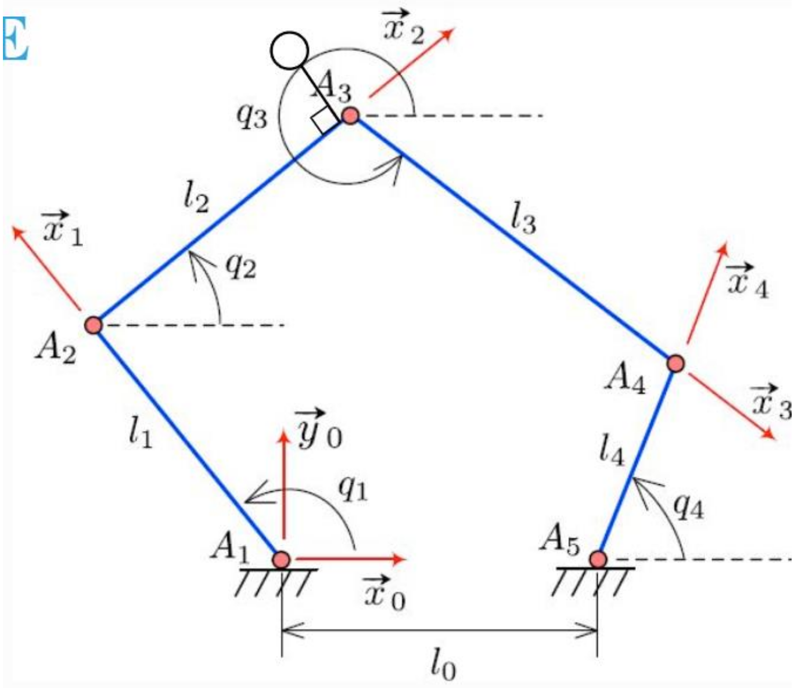
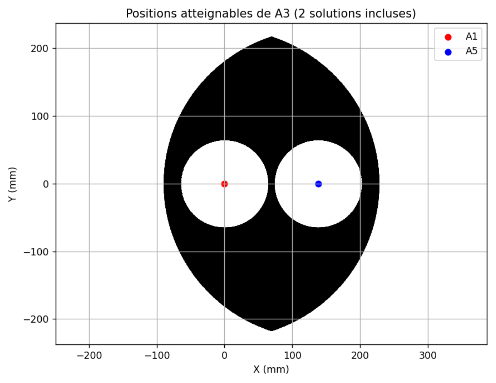
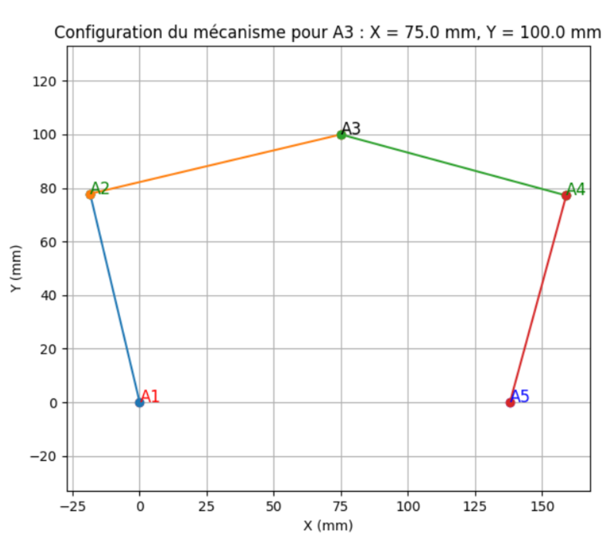

Comparaison entre résultats pratiques et analyse théorique
==========================================================

Le but de cette partie est de comparer les résultats obtenus dans la pratique grâce à la
maquette avec une analyse théorique obtenue grâce à un code Python. Pour répondre à
cet objectif, nous allons :

- Équation reliant le point A3 et :math:`q_1` et :math:`q_2`
- Vérifier ces équations en utilisant le modèle géométrique direct
- Utiliser le MGI afin d’avoir :math:`(q_1, q_2) = f(X_{A3}, Y_{A3})`

I. Équation reliant le point A3 et :math:`q_1` et :math:`q_2`
-------------------------------------------------------------

On choisit la mise en donnée suivante : on prend la base 0 comme origine du repère au
point :math:`A_1`. 

Nous faisons deux fermetures géométriques :

.. math::

   \vec{A_1A_2} + \vec{A_2A_3} + \vec{A_3A_4} + \vec{A_4A_5} + \vec{A_5A_1} = \vec{0} \\
   \vec{A_1A_2} + \vec{A_2A_3} = x + y

En projetant dans la base 0, on obtient :

.. math::

   l_1 \cos(q_1) + l_2 \cos(q_2) + l_3 \cos(q_3) - l_4 \cos(q_4) - l_0 = 0 \\
   l_1 \sin(q_1) + l_2 \sin(q_2) + l_3 \sin(q_3) - l_4 \sin(q_4) = 0 \\
   x = l_1 \cos(q_1) + l_2 \cos(q_2) \\
   y = l_1 \sin(q_1) + l_2 \sin(q_2)

On pose afin de simplifier les équations :

.. math::

   A = l_1 \cos(q_1) \\
   B = l_1 \sin(q_1) \\
   C = l_4 \cos(q_4) + l_0 \\
   D = l_4 \sin(q_4)

En faisant :math:`(5)-(7)` et :math:`(6)-(8)` on obtient :

.. math::

   (x-A)^2 + (y-B)^2 = l_2^2 \\
   (x-C)^2 + (y-D)^2 = l_3^2

En soustrayant :math:`(12)-(11)` :

.. math::

   2(A-C)x + 2(B-D)y = R

avec

.. math::

   R = l_3^2 - l_2^2 + A^2 + B^2 - C^2 - D^2

On peut réécrire l’équation sous la forme :

.. math::

   y = -\alpha x + \beta

avec

.. math::

   \alpha = \frac{A-C}{B-D}, \quad \beta = \frac{R}{2(B-D)}

En injectant dans :math:`(11)` :

.. math::

   a x^2 + b x + c = 0

avec

.. math::

   a = 1 + \alpha^2, \quad b = -2A - 2\alpha (\beta - B), \quad c = A^2 + (\beta - B)^2 - l_2^2

Pour finir, on a :

.. math::

   x = \frac{-b \pm \sqrt{b^2 - 4ac}}{2a} \\
   y = -\alpha x + \beta

II. Vérifier ces équations en utilisant le modèle géométrique direct
--------------------------------------------------------------------

En traçant :math:`y` et les deux solutions pour :math:`x`, on peut obtenir tous les points atteignables avec
le mécanisme. Ainsi il est possible de comparer si le modèle est correct en
déplaçant manuellement l’effecteur dans l’espace.

On balaye les angles :math:`q_1` et :math:`q_4` afin d’obtenir toute la zone accessible par l’effecteur.

Code Python :

.. code-block:: python

    import numpy as np
    import matplotlib.pyplot as plt
    import tkinter as tk
    from tkinter import messagebox

    # --- Paramètres géométriques du mécanisme ---
    l0 = 137.98
    l1 = 80
    l4 = 80
    l2 = 146.3
    l3 = 146.3
    A1 = np.array([0.0, 0.0])
    A5 = np.array([l0, 0.0])

    # FONCTION 1 : Résolution de q1 à partir de A3
    def solve_q1(A3):
        x, y = A3
        r = np.hypot(x, y)
        if r == 0:
            return []
        c = l1 / r
        if c > 1:
            return []
        phi = np.arctan2(y, x)
        alpha = np.arccos(c)
        return [phi + alpha, phi - alpha]

    # FONCTION 2 : Résolution de q4 à partir de A3
    def solve_q4(A3):
        x, y = A3
        X = l0 - x
        Y = y
        r = np.hypot(X, Y)
        if r == 0:
            return []
        c = l4 / r
        if c > 1:
            return []
        phi = np.arctan2(Y, X)
        alpha = np.arccos(c)
        return [phi + alpha, phi - alpha]

    # FONCTION 3 : Trace une configuration du mécanisme
    def plot_configuration(q1, q4, A3):
        A2 = A1 + np.array([l1*np.cos(q1), l1*np.sin(q1)])
        A4 = A5 + np.array([-l4*np.cos(q4), l4*np.sin(q4)])
        plt.figure(figsize=(7,6))
        plt.plot([A1[0], A2[0]], [A1[1], A2[1]], '-o')
        plt.plot([A2[0], A3[0]], [A2[1], A3[1]], '-o')
        plt.plot([A3[0], A4[0]], [A3[1], A4[1]], '-o')
        plt.plot([A4[0], A5[0]], [A4[1], A5[1]], '-o')
        plt.scatter(A1[0], A1[1], color='red')
        plt.scatter(A5[0], A5[1], color='blue')
        plt.scatter(A2[0], A2[1], color='green')
        plt.scatter(A4[0], A4[1], color='green')
        plt.scatter(A3[0], A3[1], color='black')
        plt.text(A1[0], A1[1], "A1", fontsize=12, color='red')
        plt.text(A2[0], A2[1], "A2", fontsize=12, color='green')
        plt.text(A3[0], A3[1], "A3", fontsize=12, color='black')
        plt.text(A4[0], A4[1], "A4", fontsize=12, color='green')
        plt.text(A5[0], A5[1], "A5", fontsize=12, color='blue')
        plt.axis('equal')
        plt.grid(True)
        plt.title(f"Configuration du mécanisme pour A3 : X = {A3[0]} mm, Y = {A3[1]} mm")
        plt.xlabel("X (mm)")
        plt.ylabel("Y (mm)")
        plt.show()

    # FENÊTRE POP-UP TKINTER
    def launch_gui():
        def validate():
            try:
                x = float(entry_x.get())
                y = float(entry_y.get())
            except ValueError:
                messagebox.showerror("Erreur", "Veuillez entrer des nombres valides.")
                return
            A3 = np.array([x, y])
            q1_list = solve_q1(A3)
            q4_list = solve_q4(A3)
            if len(q1_list) == 0 or len(q4_list) == 0:
                messagebox.showerror("Erreur", "Cette position A3 n'est pas atteignable.")
                return
            q1 = q1_list[0]
            q4 = q4_list[0]
            window.destroy()
            print("\n--- ANGLES EN DEGRÉS ---")
            print(f"q1 = {np.degrees(q1):.2f}°")
            print(f"q4 = {np.degrees(q4):.2f}°")
            plot_configuration(q1, q4, A3)

        window = tk.Tk()
        window.title("Choisir les coordonnées de A3")
        tk.Label(window, text="X (mm) :").grid(row=0, column=0)
        tk.Label(window, text="Y (mm) :").grid(row=1, column=0)
        entry_x = tk.Entry(window)
        entry_y = tk.Entry(window)
        entry_x.grid(row=0, column=1)
        entry_y.grid(row=1, column=1)
        btn = tk.Button(window, text="Valider", command=validate)
        btn.grid(row=2, column=0, columnspan=2)
        window.mainloop()

    launch_gui()

III. Utiliser le MGI afin d’avoir :math:`(q_1, q_2) = f(X_{A3}, Y_{A3})`
------------------------------------------------------------------------

Maintenant que le modèle est vérifié, on peut passer au modèle indirect. Le code suivant
permet de tracer les positions possibles du système. Il faut entrer les coordonnées du
point :math:`A3` souhaité. Si le point n’est pas atteignable, le code renverra une erreur.

.. code-block:: python

    import numpy as np
    import matplotlib.pyplot as plt

    l0 = 137.98
    l1 = 80
    l4 = 80
    l2 = 146.3
    l3 = 146.3

    A1 = np.array([0.0, 0.0])
    A5 = np.array([l0, 0.0])

    q1_range = np.linspace(-np.pi+0.01, np.pi-0.01, 400)
    q4_range = np.linspace(-np.pi+0.01, np.pi-0.01, 400)

    A3_solutions = []

    def circle_intersections(C1, r1, C2, r2):
        x1, y1 = C1
        x2, y2 = C2
        d = np.hypot(x2 - x1, y2 - y1)
        if d > r1 + r2 or d < abs(r1 - r2) or d == 0:
            return []
        a = (r1*r1 - r2*r2 + d*d) / (2*d)
        h = np.sqrt(r1*r1 - a*a)
        xm = x1 + a*(x2-x1)/d
        ym = y1 + a*(y2-y1)/d
        xs1 = xm + h*(y2 - y1)/d
        ys1 = ym - h*(x2 - x1)/d
        xs2 = xm - h*(y2 - y1)/d
        ys2 = ym + h*(x2 - x1)/d
        return [(xs1, ys1), (xs2, ys2)]

    for q1 in q1_range:
        A2 = A1 + np.array([l1*np.cos(q1), l1*np.sin(q1)])
        for q4 in q4_range:
            A4 = A5 + np.array([-l4*np.cos(q4), l4*np.sin(q4)])
            inter = circle_intersections(A2, l2, A4, l3)
            for P in inter:
                A3_solutions.append(P)

    A3_solutions = np.array(A3_solutions)

    plt.figure(figsize=(8, 6))
    plt.scatter(A3_solutions[:,0], A3_solutions[:,1], s=1, color="black")
    plt.scatter([A1[0]], [A1[1]], color="red", label="A1")
    plt.scatter([A5[0]], [A5[1]], color="blue", label="A5")
    plt.axis('equal')
    plt.grid(True)
    plt.title("Positions atteignables de A3 (2 solutions incluses)")
    plt.xlabel("X (mm)")
    plt.ylabel("Y (mm)")
    plt.legend()
    plt.show()
