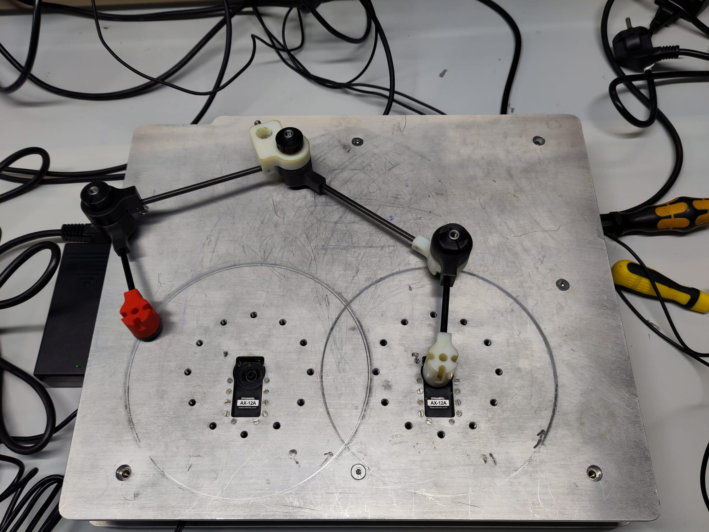
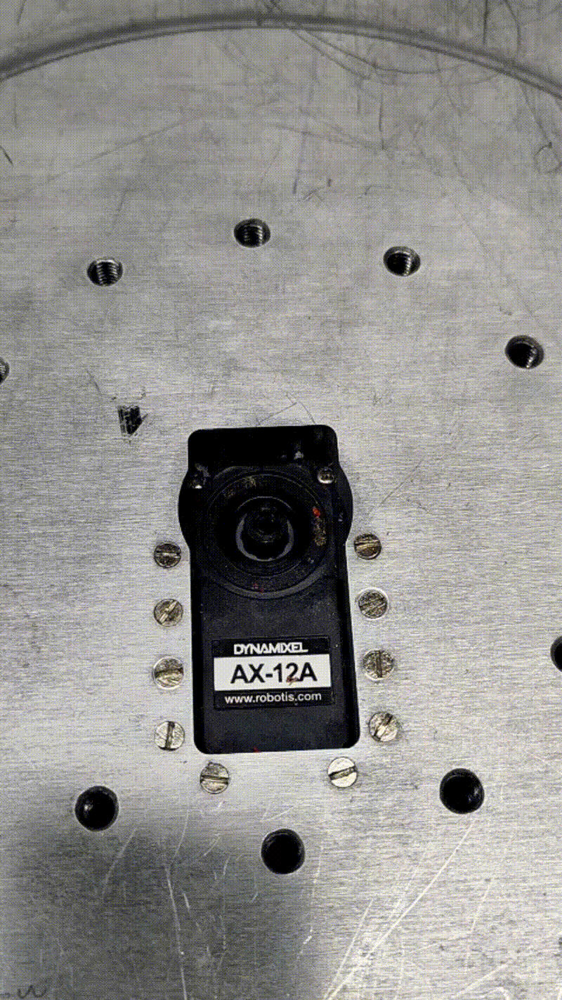
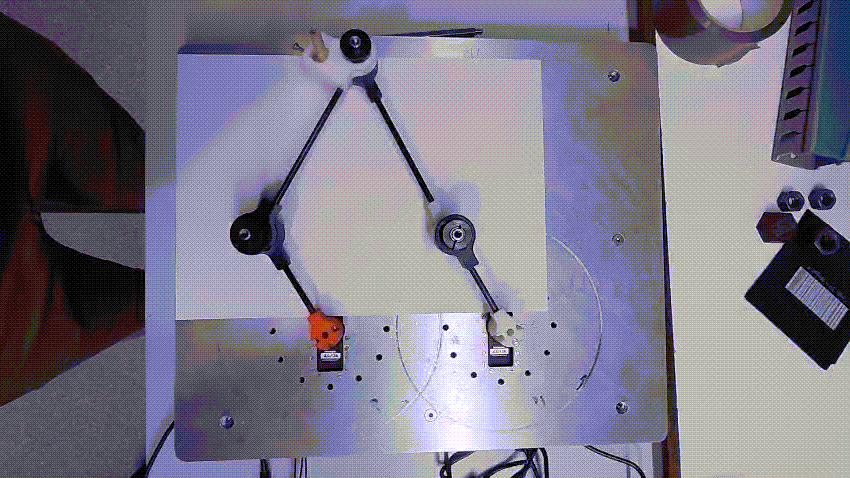

Pilotage du panthographe 
========================

Premier test : Utilisation des moteurs Dynamixel
^^^^^^^^^^^^^^^^^^^^^^^^^^^^^^^^^^^^^^^^^^^^^^^^
Rapellons que nous utilisons les servomoteur AX-12 de chez Dynamixel. Pour les piloter nous utilisons le convertisseur de communication USB U2D2.

Branchement des moteurs : 
-------------------------

Pour tester les moteurs, nous avons suivi un tutoriel de Robotics OpenSourceTeam. Dans leur vidéo : DYNAMIXEL Quick Start Guide for ROS 2 `ici <https://www.youtube.com/watch?v=E8XPqDjof4U>`_, il présentent comment brancher les différents composants entre eux et comment faire tourner un moteur XL430-W250 de chez Dynamixel.
Il faudra donc adapter certaines parties du code. L'objectif est de déjà commander un moteurs. Puis dans un second temps, de faire le lien entre l'URDF et le pilotage des moteurs.

Matériel nécéssaire d'après la vidéo :

.. figure:: ../images/materiel.png
   :alt: matériel
   :width: 600px
   :align: center

.. note::
   Nous remplaçons le moteur XL430-W250-T par le AX-12A

Branchement à effectuer :

.. figure:: ../images/branchements.png
   :alt: Branchement
   :width: 600px
   :align: center

Programmation : 
---------------
Tout d'abord, nous avons créé notre répertoire de travail :

.. code-block:: bash

   mkdir -p ~/robotics_ws/src

Puis nous nous rendons dedans à l'aide de la commande suivante :

.. code-block:: bash

   cd ~/robotics_ws/src/

Ensuite nous clonons l'exemple de Dynamixel rajoutons humbel-devel afin que nous puissions le lancer avec n'importe quelle version de ROS2: 

.. code-block:: bash

   git clone -b humbel-devel https://github.com/ROBOTICS-GIT/DynamixelSDK

Puis, entrez afin de compiler le projet: 

.. code-block:: bash

   cd ~/robotis_ws && colcon build --symlink-install

A présent, sourçons notre projet à l'aide de la commande suivante : 

.. code-block:: bash

   source /opt/ros/humble/setup.bash

Afin d'éviter de devoir sourcer dans chaque terminal, modifions le fichier bashrc.

.. code-block:: bash

   sudo nano ~/.bashrc

Puis Ctrl + S et Ctrl + X pour enregistrer et quitter.

La communication avec les moteurs se fait via USB. Via la commande suivante, nous pouvons savoir sur quel port nous communiquons : Retournons tout d'abord à la racine

.. code-block:: bash

   cd ..
   cd ..
   ls /dev/tty*

Dans notre cas le port était : /dev/ttyUSB0

Puis utilisons whoami afin de permet de connaitre le nom de son compte linux :

.. code-block:: bash

   whoami

.. code-block:: bash

   sudo usermod -aG dialout <linux_account>

Le projet que nous avons cloné, est adapté pour les moteurs XL430-W250. Ainsi nous devons adapter le code pour qu'il fonctionne avec nos moteurs. Nous devons utiliser adapter les adresses du tableau : Control Table of Ram Area de la datasheet.
Nous devons changer certaines adresses dans le fichier **read_write_node.cpp**. Ainsi nous avons changé de répertoire et sommes allez dans

.. code-block:: bash

   cd ~/robotis_ws/src/DynamixelSDK/dynamixel_sdk_examples/src && code .

Dans le fichier **read_write_node.cpp**, nous avons changez les lignes 42 à 46 suivantes en : 

.. code-block:: bash

   // Control table address for X series (except XL-320)
   #define ADDR_OPERATING_MODE 255
   #define ADDR_TORQUE_ENABLE 24
   #define ADDR_GOAL_POSITION 30
   #define ADDR_PRESENT_POSITION 36

Et ligne 49, nous avons adapté le protocole de communication.

.. code-block:: bash

   #define PROTOCOL_VERSION 1.0

Puis ligne 52 nous devons adapter le baudrate en 115200 afin de communiquer à la même fréquence
Puis nous faisons un colcon build :

.. code-block:: bash

   cd ~/robotics_ws
   rm -rf build install log
   colcon build --symlink-install

Puis sourçons :

.. code-block:: bash

   cd ~/robotis_ws && source install/setup.bash

Pour éviter de casser la maquette, nous avons déconnecté le bras du moteur 1.

Ensuite lançons l'exemple. A la racine faire :

.. code-block:: bash

   ros2 run dynamixel_sdk_examples read_write_node

Puis dans un seconde terminal, écrire : 

.. code-block:: bash

   ros2 topic pub -1 /set_position dynamixel_sdk_custom_interfaces/SetPosition "{id: 1, position: 0}"

Faire varier theta entre 0 et 1023, afin de faire tourner le moteur d'un certain angle.

Position 1
----------

Piloter en 4 positions : 
^^^^^^^^^^^^^^^^^^^^^^^^

Ensuite, nous avons créé un noeud, afin que notre moteur 1 aille en 4 positions différentes. Pour ce faire, nous nous créons un package : 

.. code-block:: bash

   cd ~/robotics_ws/src
   ros2 pkg create --build-type ament_python dynamixel_controller --dependencies rclpy dynamixel_sdk_custom_interfaces

Nous créons le node Python :

.. code-block:: bash

   nano move_positions.py

Dans ce fichier, nous collons le code python suivant : 

.. code-block:: bash

   #!/usr/bin/env python3

   import rclpy
   from rclpy.node import Node
   from dynamixel_sdk_custom_interfaces.msg import SetPosition
   import time

   class DynamixelMover(Node):
      def __init__(self):
         super().__init__('dynamixel_mover')
         # Publisher sur le topic /set_position
         self.pub = self.create_publisher(SetPosition, '/set_position', 10)

         # Liste des positions à atteindre
         self.positions = [0, 200, 500, 300, 0]
         self.id = 1  # ID du moteur Dynamixel

         self.timer_period = 2.0  # secondes entre chaque mouvement
         self.timer = self.create_timer(self.timer_period, self.move_motor)
         self.index = 0
         self.get_logger().info("Dynamixel Mover Node Started")

      def move_motor(self):
         if self.index < len(self.positions):
               pos = self.positions[self.index]
               msg = SetPosition()
               msg.id = self.id
               msg.position = pos
               self.pub.publish(msg)
               self.get_logger().info(f'Publishing position #{self.index+1}: {msg}')
               self.index += 1
         else:
               self.get_logger().info("All positions reached, stopping.")
               self.timer.cancel()  # stop the timer

   def main(args=None):
      rclpy.init(args=args)
      node = DynamixelMover()
      rclpy.spin(node)
      node.destroy_node()
      rclpy.shutdown()

   if __name__ == '__main__':
      main()

Puis on modifie le fichier setup.py

Dans : ~/robotics_ws/src/dynamixel_controller/setup.py il faut modifier : 

.. code-block:: bash

   entry_points={
    'console_scripts': [
        'move_positions = dynamixel_controller.move_positions:main',
      ],
   },

Dans ~/robotics_ws, on construit le package : 

.. code-block:: bash

   colcon build --symlink-install
   source install/setup.bash

Puis, on lance le node : 

.. code-block:: bash

   ros2 run dynamixel_controller move_positions

Dans le terminal, nous voyions : 

.. code-block:: bash

   [INFO] [dynamixel_mover]: Publishing position #1: dynamixel_sdk_custom_interfaces.msg.SetPosition(id=1, position=1000)
   [INFO] [dynamixel_mover]: Publishing position #2: ...

Position 4
----------

.. figure:: ../_static/videos/4pos.gif
   :width: 20%
   :align: center

Interprétation de la position angulaire
^^^^^^^^^^^^^^^^^^^^^^^^^^^^^^^^^^^^^^^

- 0   → 0°
- 512 → ~150°
- 1023 → ~300°

.. warning::

   Le débattement angulaire maximal est de **300°**.

Une fois que nous avons piloter en position un moteur. Nous nous sommes rendu compte qu'en remplaçant l'identifiant 1 par un 2, nous parvenons à piloter en position le 2nd moteur.
Nous avons ainsi cherché à piloter en position les deux moteurs en même temps.

Piloter deux moteurs en même temps : 
^^^^^^^^^^^^^^^^^^^^^^^^^^^^^^^^^^^^

Tout d'abord, nous avons créé un code, qui permet de commander la position des deux moteurs simultanément et individuellement.

Pour ce faire, nous nous plaçons dans le workspace : 

.. code-block:: bash

   cd ~/robotics_ws/src

L'on va créé un package python afin de mettre le fichier que nous venons de créer dedans : 

.. code-block:: bash

   ros2 pkg create two_motors_controller --build-type ament_python --dependencies rclpy dynamixel_sdk_custom_interfaces

Voici l'endroit où il faudra mettre le fichier move_two_motors.py :  

.. code-block:: bash

   ~/robotics_ws/src/two_motors_controller/
   └── two_motors_controller/
      └── move_two_motors.py

Nous créons le fichier : 

.. code-block:: bash

   nano move_two_motors.py

Dans ce fichier nous mettons le code : 

.. code-block:: bash

      #!/usr/bin/env python3

   import rclpy
   from rclpy.node import Node
   from dynamixel_sdk_custom_interfaces.msg import SetPosition
   import time

   class TwoMotorsController(Node):

      def __init__(self):
         super().__init__('two_motors_controller')

         self.publisher_ = self.create_publisher(
               SetPosition,
               '/set_position',
               10
         )

         # 🔹 Deux moteurs, chacun aura sa propre séquence
         self.motor_ids = [1, 2]

         # 🔹 Positions à atteindre pour chaque moteur
         # Moteur 1 : [0, 100, 150, 0]
         # Moteur 2 : [0, 200, 100, 50]
         self.targets = [
               [0, 0],       # étape 0 : moteur 1 → 0, moteur 2 → 0
               [164, 338],   # étape 1
               [398, 216],   # étape 2
               [0, 0]       # étape 3
         ]

         # Paramètres de vitesse "logicielle"
         self.step = 5        # plus petit = plus lent
         self.delay = 0.05    # plus grand = plus lent

         # 🔹 Position de départ : on initialise avec la première position cible
         self.current_position = self.targets[0][0]  # pour moteur 1
         self.current_position2 = self.targets[0][1] # pour moteur 2

         self.run_sequence()

      def move_slowly(self, target1, target2):
         # Calcul du pas pour chaque moteur
         step1 = self.step if target1 > self.current_position else -self.step
         step2 = self.step if target2 > self.current_position2 else -self.step

         # Déplacement pas à pas
         pos1, pos2 = self.current_position, self.current_position2
         while pos1 != target1 or pos2 != target2:
               # Moteur 1
               if pos1 != target1:
                  pos1 += step1
                  # éviter de dépasser la cible
                  if (step1 > 0 and pos1 > target1) or (step1 < 0 and pos1 < target1):
                     pos1 = target1

               # Moteur 2
               if pos2 != target2:
                  pos2 += step2
                  if (step2 > 0 and pos2 > target2) or (step2 < 0 and pos2 < target2):
                     pos2 = target2

               # Publier
               msg1 = SetPosition()
               msg1.id = self.motor_ids[0]
               msg1.position = pos1
               self.publisher_.publish(msg1)

               msg2 = SetPosition()
               msg2.id = self.motor_ids[1]
               msg2.position = pos2
               self.publisher_.publish(msg2)

               time.sleep(self.delay)

         # Mettre à jour les positions courantes
         self.current_position = target1
         self.current_position2 = target2

      def run_sequence(self):
         for step_targets in self.targets:
               target1, target2 = step_targets
               self.get_logger().info(f'Moving motors slowly to {target1}, {target2}')
               self.move_slowly(target1, target2)
               time.sleep(1)

   def main(args=None):
      rclpy.init(args=args)
      node = TwoMotorsController()
      rclpy.shutdown()

   if __name__ == '__main__':
      main()

Puis nous rendons le fichier executable : 

.. code-block:: bash

   chmod +x ~/robotics_ws/src/two_motors_controller/two_motors_controller/move_two_motors.py

Puis, nous ouvrons setup.py afin de le modifier : 

.. code-block:: bash

   nano ~/robotics_ws/src/two_motors_controller/setup.py

Modifier ça : 

.. code-block:: bash

   entry_points={
    'console_scripts': [
        'move_two_motors = two_motors_controller.move_two_motors:main',
      ],
   },

Puis nous recompilons : 

.. code-block:: bash

   cd ~/robotics_ws
   colcon build
   source install/setup.bash

On lance le node que nous venons de créer : 

.. code-block:: bash

   ros2 run two_motors_controller move_two_motors

Modèle géométrique indirect : 
^^^^^^^^^^^^^^^^^^^^^^^^^^^^^

Nous avons fait le modèle géométrique directe sur un code python à part. Sur ce code nous donnons en entrée la postion que nous aimerions atteindre avec notre mécanisme, le code nous sort alors la consigne à donner à nos moteurs. 
Ainsi, nous pouvons utiliser le code précédent une fois avoir utilisé ce fichier.

.. code-block:: bash

   import numpy as np
   import matplotlib.pyplot as plt
   import tkinter as tk
   from tkinter import messagebox

   # ===================================================
   #   CONSTANTES GEOMETRIQUES (RIGIDES)
   # ===================================================
   L0 = 137.98
   L1 = 80.0
   L2 = 146.3
   L3 = 146.3
   L4 = 80.0

   A1 = np.array([0.0, 0.0])
   A5 = np.array([L0, 0.0])

   ANGLE_REF = 2 * np.pi / 3  # 120°

   # ===================================================
   #   OUTILS
   # ===================================================
   def normalize_angle(a):
      return a % (2 * np.pi)

   def angle_valid(a):
      d = np.degrees(a)
      return not (300 <= d < 360)

   def circles_intersection(C1, r1, C2, r2):
      d = np.linalg.norm(C2 - C1)
      if d > r1 + r2 or d < abs(r1 - r2) or d == 0:
         return []

      a = (r1**2 - r2**2 + d**2) / (2 * d)
      h = np.sqrt(max(r1**2 - a**2, 0.0))

      P = C1 + a * (C2 - C1) / d
      perp = np.array([-(C2 - C1)[1], (C2 - C1)[0]]) / d

      return [P + h * perp, P - h * perp]

   def segments_intersect(p1, p2, p3, p4):
      def ccw(a, b, c):
         return (c[1]-a[1])*(b[0]-a[0]) > (b[1]-a[1])*(c[0]-a[0])
      return ccw(p1, p3, p4) != ccw(p2, p3, p4) and \
            ccw(p1, p2, p3) != ccw(p1, p2, p4)

   # ===================================================
   #   INVERSE CINEMATIQUE : A3 -> (q1, q4)
   # ===================================================
   def solve_from_A3(A3):
      A2_list = circles_intersection(A1, L1, A3, L2)
      A4_list = circles_intersection(A5, L4, A3, L3)

      solutions = []

      for A2 in A2_list:
         theta1 = np.arctan2(A2[1] - A1[1], A2[0] - A1[0])
         q1 = normalize_angle(theta1 - ANGLE_REF)
         if not angle_valid(q1):
               continue

         for A4 in A4_list:
               # ✅ CORRECTION ICI
               theta4 = np.arctan2(A4[1] - A5[1], A4[0] - A5[0])
               q4 = normalize_angle(theta4 - ANGLE_REF)
               if not angle_valid(q4):
                  continue

               if segments_intersect(A1, A2, A3, A4):
                  continue
               if segments_intersect(A2, A3, A4, A5):
                  continue

               solutions.append((q1, q4, A2, A4))

      return solutions

   # ===================================================
   #   TRACE
   # ===================================================
   def plot_solution(q1, q4, A2, A3, A4):
      plt.figure(figsize=(6, 6))
      for P, Q in [(A1, A2), (A2, A3), (A3, A4), (A4, A5)]:
         plt.plot([P[0], Q[0]], [P[1], Q[1]], '-o')

      for name, P in zip(
         ["A1", "A2", "A3", "A4", "A5"],
         [A1, A2, A3, A4, A5]
      ):
         plt.text(P[0], P[1], name)

      plt.axis("equal")
      plt.grid(True)
      plt.title("Quadrilatère articulé – cohérence q4 OK")
      plt.show()

   # ===================================================
   #   GUI
   # ===================================================
   def launch_gui():
      def validate():
         try:
               x = float(entry_x.get())
               y = float(entry_y.get())
         except ValueError:
               messagebox.showerror("Erreur", "Coordonnées invalides.")
               return

         A3 = np.array([x, y])
         sols = solve_from_A3(A3)

         if not sols:
               messagebox.showerror("Erreur", "Position A3 non réalisable.")
               return

         q1, q4, A2, A4 = sols[0]
         window.destroy()

         q1_1023 = q1*1023/360
         q4_1023 = q4*1023/360
         print("\n--- ANGLES COHERENTS ---")
         print(f"q1 = {np.degrees(q1):.2f}°")
         print(f"q4 = {np.degrees(q4):.2f}°")
         print(f"q1 = {np.degrees(q1_1023):.2f}")
         print(f"q4 = {np.degrees(q4_1023):.2f}")
         plot_solution(q1, q4, A2, A3, A4)

      window = tk.Tk()
      window.title("A3 → angles (réf 120°)")

      tk.Label(window, text="X A3 (mm)").grid(row=0, column=0)
      tk.Label(window, text="Y A3 (mm)").grid(row=1, column=0)

      entry_x = tk.Entry(window)
      entry_y = tk.Entry(window)
      entry_x.grid(row=0, column=1)
      entry_y.grid(row=1, column=1)

      tk.Button(window, text="Valider", command=validate)\
         .grid(row=2, column=0, columnspan=2)

      window.mainloop()

   launch_gui()

Nous avons rentré les positions suivantes :

.. list-table::
   :align: center

   * - .. image:: ../images/position0.jpeg
          :width: 200px
          :alt: matériel
     - .. image:: ../images/position1.jpeg
          :width: 200px
          :alt: matériel
     - .. image:: ../images/position2.jpeg
          :width: 200px
          :alt: matériel

Nous obtenons les positions d'angle du moteur suivant : 
Les résultats pour le moteur 1 : [0,164,398,0], et pour le moteur 2 : [0,338, 216, 0]

Puis nous relançons le code voici la vidéo final !

Voici les positions théoriques intermédiaires : 

.. list-table::
   :align: center

   * - .. image:: ../images/theo_1.jpeg
          :width: 300px
          :alt: matériel
     - .. image:: ../images/theo_2.jpeg
          :width: 300px
          :alt: matériel

