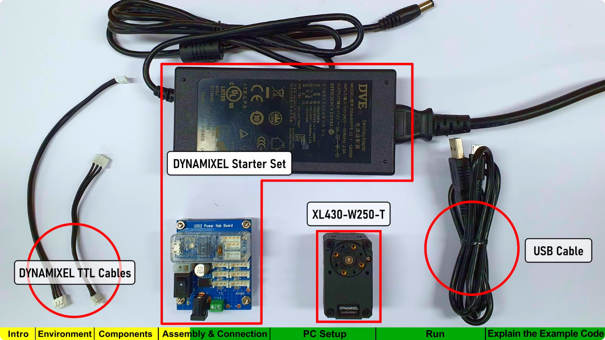
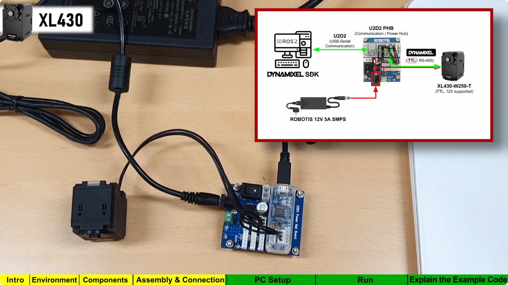

Tests et installation logicielle
================================

Premier test : Utilisation des moteurs Dynamixel
^^^^^^^^^^^^^^^^^^^^^^^^^^^^^^^^^^^^^^^^^^^^^^^^
Rapellons que nous utilisons les servomoteur AX-12 de chez Dynamixel. Pour les piloter nous utilisons le convertisseur de communication USB U2D2.

Branchement des moteurs : 
-------------------------

Pour tester les moteurs, nous avons suivi un tutoriel de Robotics OpenSourceTeam. Dans leur vidéo : DYNAMIXEL Quick Start Guide for ROS 2 `ici <https://www.youtube.com/watch?v=E8XPqDjof4U>`_, il présentent comment brancher les différents composants entre eux et comment faire tourner un moteur XL430-W250 de chez Dynamixel.
Il faudra donc adapter certaines parties du code. L'objectif est de déjà commander un moteurs. Puis dans un second temps, de faire le lien entre l'URDF et le pilotage des moteurs.

Matériel nécéssaire d'après la vidéo :

.. note::
   Nous remplaçons le moteur XL430-W250-T par le AX-12A

Branchement à effectuer :

Programmation : 
---------------
Tout d'abord, nous avons créé notre répertoire de travail :

.. code-block:: bash

   mkdir -p ~/robotics_ws/src

Puis nous nous rendons dedans à l'aide de la commande suivante : 
.. code-block:: bash

   cd ~/robotics_ws/src/

Ensuite nous clonons l'exemple de Dynamixel rajoutons humbel-devel afin que nous puissions le lancer avec n'importe quelle version de ROS2: 

.. code-block:: bash

   git clone -b humbel-devel https://github.com/ROBOTICS-GIT/DynamixelSDK

Puis, entrez afin de compiler le projet: 

.. code-block:: bash

   cd ~/robotis_ws && colcon build --symlink-install

A présent, sourçons notre projet à l'aide de la commande suivante : 
.. code-block:: bash

   source /opt/ros/humble/setup.bash

Afin d'éviter de devoir sourcer dans chaque terminal, modifions le fichier bashrc.

.. code-block:: bash

   sudo nano ~/.bashrc

Puis Ctrl + S et Ctrl + X pour enregistrer et quitter.

La communication avec les moteurs se fait via USB. Via la commande suivante, nous pouvons savoir sur quel port nous communiquons : Retournons tout d'abord à la racine

.. code-block:: bash

   cd ..
   cd ..
   ls /dev/tty*

Dans notre cas le port était : /dev/ttyUSB0

Puis utilisons whoami afin de permet de connaitre le nom de son compte linux :

.. code-block:: bash

   whoami

.. code-block:: bash

   sudo usermod -aG dialout <linux_account>

Le projet que nous avons cloné, est adapté pour les moteurs XL430-W250. Ainsi nous devons adapter le code pour qu'il fonctionne avec nos moteurs. Nous devons utiliser adapter les adresses du tableau : Control Table of Ram Area de la datasheet.
Nous devons changer certaines adresses dans le fichier **read_write_node.cpp**. Ainsi nous avons changé de répertoire et sommes allez dans

.. code-block:: bash

   cd ~/robotis_ws/src/DynamixelSDK/dynamixel_sdk_examples/src && code .

Dans le fichier **read_write_node.cpp**, nous avons changez les lignes 42 à 46 suivantes en : 

.. code-block:: bash

   // Control table address for X series (except XL-320)
   #define ADDR_OPERATING_MODE 255
   #define ADDR_TORQUE_ENABLE 24
   #define ADDR_GOAL_POSITION 30
   #define ADDR_PRESENT_POSITION 36

Et ligne 49, nous avons adapté le protocole de communication.

.. code-block:: bash

   #define PROTOCOL_VERSION 1.0

Puis ligne 52 nous devons adapter le baudrate en 115200 afin de communiquer à la même fréquence
Puis nous faisons un colcon build :
.. code-block:: bash

   cd ~/robotics_ws
   rm -rf build install log
   colcon build --symlink-install

Puis sourçons :

.. code-block:: bash

   cd ~/robotis_ws && source install/setup.bash

Ensuite lançons l'exemple. A la racine faire :

.. code-block:: bash

   ros2 run dynamixel_sdk_examples read_write_node

Puis dans un seconde terminal, écrire : 

.. code-block:: bash

   ros2 topic pub -1 /set_position dynamixel_sdk_custom_interfaces/SetPosition "{id: 1, position: 0}"

Faire varier 0 entre 0 et 1023, afin de faire tourner le moteur d'un certain angle.

Pour éviter de casser la maquette, nous avons déconnecté le bras du moteur 1.

Position 1
----------

.. raw:: html

   <video width="80%" controls>
       <source src="_static/videos/1pos.mp4" type="video/mp4">
       Votre navigateur ne supporte pas la vidéo.
   </video>

Ensuite, nous avons créé un noeud, afin que notre moteur 1 aille en 4 positions différentes. Pour ce faire, nous nous créons un package : 

.. code-block:: bash

   cd ~/robotics_ws/src
   ros2 pkg create --build-type ament_python dynamixel_controller --dependencies rclpy dynamixel_sdk_custom_interfaces

Nous créons le node Python :

.. code-block:: bash

   nano move_positions.py

Dans ce fichier, nous collons le code python suivant : 

.. code-block:: bash

   #!/usr/bin/env python3

   import rclpy
   from rclpy.node import Node
   from dynamixel_sdk_custom_interfaces.msg import SetPosition
   import time

   class DynamixelMover(Node):
      def __init__(self):
         super().__init__('dynamixel_mover')
         # Publisher sur le topic /set_position
         self.pub = self.create_publisher(SetPosition, '/set_position', 10)

         # Liste des positions à atteindre
         self.positions = [0, 200, 500, 300, 0]
         self.id = 1  # ID du moteur Dynamixel

         self.timer_period = 2.0  # secondes entre chaque mouvement
         self.timer = self.create_timer(self.timer_period, self.move_motor)
         self.index = 0
         self.get_logger().info("Dynamixel Mover Node Started")

      def move_motor(self):
         if self.index < len(self.positions):
               pos = self.positions[self.index]
               msg = SetPosition()
               msg.id = self.id
               msg.position = pos
               self.pub.publish(msg)
               self.get_logger().info(f'Publishing position #{self.index+1}: {msg}')
               self.index += 1
         else:
               self.get_logger().info("All positions reached, stopping.")
               self.timer.cancel()  # stop the timer

   def main(args=None):
      rclpy.init(args=args)
      node = DynamixelMover()
      rclpy.spin(node)
      node.destroy_node()
      rclpy.shutdown()

   if __name__ == '__main__':
      main()

Puis on modifie le fichier setup.py

Dans : ~/robotics_ws/src/dynamixel_controller/setup.py il faut modifier : 

.. code-block:: bash

   entry_points={
    'console_scripts': [
        'move_positions = dynamixel_controller.move_positions:main',
      ],
   },

Dans ~/robotics_ws, on construit le package : 

.. code-block:: bash

   colcon build --symlink-install
   source install/setup.bash

Puis, on lance le node : 

.. code-block:: bash

   ros2 run dynamixel_controller move_positions

Dans le terminal, nous voyions : 
.. code-block:: bash

   [INFO] [dynamixel_mover]: Publishing position #1: dynamixel_sdk_custom_interfaces.msg.SetPosition(id=1, position=1000)
   [INFO] [dynamixel_mover]: Publishing position #2: ...

Position 4
----------

.. raw:: html

   <video width="80%" controls>
       <source src="_static/videos/4pos.mp4" type="video/mp4">
       Votre navigateur ne supporte pas la vidéo.
   </video>

Brouillon : Commandes ROS
^^^^^^^^^^^^^^^^^^^^^^^^^

Initialisation de l’environnement ROS 2 :

.. code-block:: bash

   source /opt/ros/jazzy/setup.sh

Vérification de la version ROS :

.. code-block:: bash

   apt show ros-${ROS_DISTRO}-ros-core

---

Récupération de la position des moteurs (AX-12A)
^^^^^^^^^^^^^^^^^^^^^^^^^^^^^^^^^^^^^^^^^^^^^^^^

Pour les servos AX-12A, la position actuelle se lit à l’adresse **36**.

Installation de la bibliothèque
"""""""""""""""""""""""""""""""

.. code-block:: bash

   sudo apt update
   sudo apt install python3-pip
   pip install dynamixel-sdk

Vérification du port série :

.. code-block:: bash

   ls /dev/ttyUSB*

---

Test de communication Python
^^^^^^^^^^^^^^^^^^^^^^^^^^^^

.. code-block:: python

   from dynamixel_sdk import *

   DEVICENAME = '/dev/ttyUSB0'
   BAUDRATE = 57600
   PROTOCOL_VERSION = 1.0
   DXL_ID = 1
   ADDR_PRESENT_POSITION = 36

   portHandler = PortHandler(DEVICENAME)
   packetHandler = PacketHandler(PROTOCOL_VERSION)

   portHandler.openPort()
   portHandler.setBaudRate(BAUDRATE)

   pos, _, _ = packetHandler.read2ByteTxRx(
       portHandler, DXL_ID, ADDR_PRESENT_POSITION)

   print(f"Position actuelle : {pos}")

---

Interprétation de la position angulaire
^^^^^^^^^^^^^^^^^^^^^^^^^^^^^^^^^^^^^^^

- 0   → 0°
- 512 → ~150°
- 1023 → ~300°

.. warning::

   Le débattement angulaire maximal est de **300°**.
