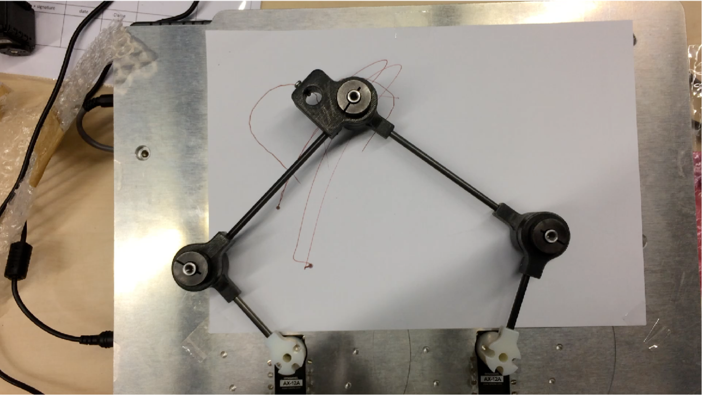

.. Dm_info_indus__tutorial documentation master file, created by
   sphinx-quickstart on Wed Sep 17 09:02:51 2025.
   You can adapt this file completely to your liking, but it should at least
   contain the root `toctree` directive.

Informatique industrielle
=====================================

Ce projet a été réalisé par Bonnet Gaëtan, Dalibard Mélanie et Luton Philémon dans le cadre du cours d’informatique industrielle de l’année 2025/2026 en MIQ5.

L'objectif de cette page internet est d'expliquer le fonctionnement de la plateforme robotique « pantographe » avec ROS2 sur une Raspberry Pi (PI5) et de documenter le projet.

Voici une image de la maquette :

Le projet consiste à :

#. Décrire la plateforme mécanique
#. Décrire le matériel électronique, la carte Dynamixel avec des liens vers les documentations techniques (datasheets)
#. Créer la représentation mécanique du pantographe dans un fichier URDF
#. Visualiser le résultat avec RViz
#. Décrire la dynamique et donner les équations permettant de piloter la position de l’organe terminal du pantographe
#. Créer un package ROS2 pour contrôler le pantographe
#. Créer des tests et documenter ces tests
#. Créer un code pour dessiner avec le pantographe
#. Tester le pantographe en conditions réelles
#. Créer un code de simulation pour le pantographe
#. Tester la simulation avec Gazebo et RViz

Le rendu attendu est un site web correspondant à un fork du site internet de M. Yguel. Ce site décrira comment nous sommes parvenus à piloter le pantographe réel.

.. toctree::
   :maxdepth: 2
   :caption: Contents:
